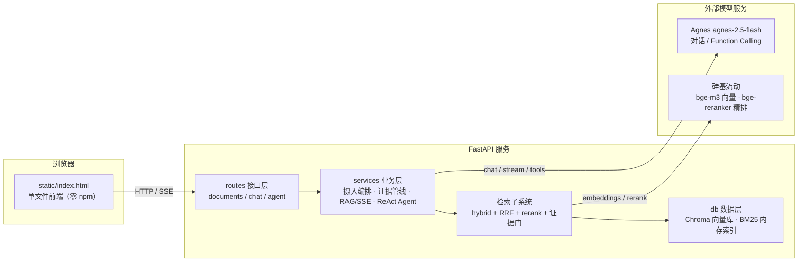
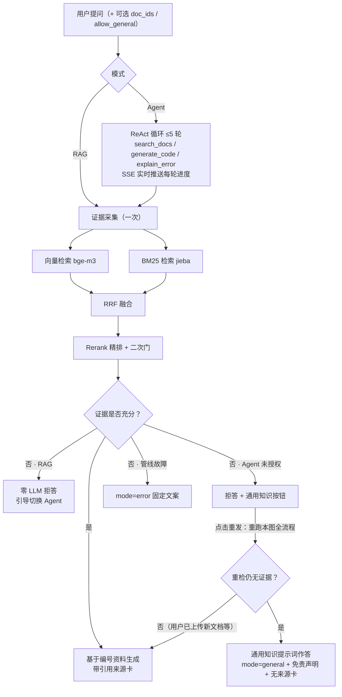

# DevDocs Copilot · 技术文档智能问答助手

[](https://www.python.org/)
[](https://fastapi.tiangolo.com/)
[](https://www.trychroma.com/)
[](https://docs.pytest.org/)
[](https://developer.mozilla.org/en-US/docs/Web/API/Server-sent_events)

> 给开发文档装上一个**可溯源、会拒答、能兜底**的 AI 问答助手：先查文档再回答，查不到就明说，而不是一本正经地编造。

DevDocs Copilot 是一个从零实现的 RAG（检索增强生成）+ Agent 应用：把团队的 Markdown / TXT / PDF / DOCX 文档摄入本地向量库，用户提问时经 **BM25 + 向量混合检索 → RRF 融合 → Rerank 二次精排 → 证据门** 两道门槛后再交给大模型作答；Agent 模式下模型以 ReAct 循环自主调用三个工具多轮查证，**执行过程经 SSE 实时上屏**（当前轮次、查询词、成败状态、计时），不再让用户面对黑盒空等。全程 FastAPI 异步服务 + 单文件零构建前端，319 个测试严格 TDD 护航。

---

## 目录

- [核心特性](#核心特性)
- [功能矩阵](#功能矩阵)
- [系统架构](#系统架构)
- [快速开始](#快速开始)
- [API 一览](#api-一览)
- [评测报告](#评测报告)
- [工程实践亮点](#工程实践亮点)
- [目录结构](#目录结构)
- [技术栈](#技术栈)
- [后续规划](#后续规划)

---

## 核心特性

- **两阶段混合检索，答案必须有出处** —— 向量（bge-m3）与 BM25（jieba 中文分词）双路召回，RRF 排名融合，cross-encoder rerank 精排取 Top-5；相似度门（0.45）与精排二次门（0.02，由评测实测校准）双重把关，无证据零 LLM 拒答。
- **Agent 模式：ReAct + 三工具 + 接地约束** —— 模型自主决定"查文档 / 生成代码示例 / 解释报错"，最多 5 轮工具循环；代码生成工具强制"先检索到证据才执行"，杜绝脱离文档凭空写码；完整 steps 执行轨迹对用户可见，黑箱变玻璃箱。
- **双 SSE 实时流，等待全程不黑屏** —— RAG 答案逐字输出；Agent 推 step 级实时进度（分析问题 → 正在检索"某关键词" → 成败徽标 → 组织最终答案 + 秒表计时），两种模式都支持中途停止与原气泡重试。Agent 进度流以 `asyncio.Queue` 桥接执行任务与 SSE 生成器，客户端断连即取消后续上游调用。
- **接地优先的通用知识兜底** —— Agent 穷尽检索仍无答案时，用户可显式点击「用通用知识再答」；服务端**重跑完整检索**确认仍无证据后才切换提示词，答案首行强制免责声明（服务端后置补齐，不靠模型自觉）。授权仅当次请求有效，不写会话、不留状态。
- **文档级检索范围** —— 按视图或自选文档圈定检索范围（`doc_ids` 下推 Chroma `where` + BM25 候选预筛），范围过滤严格先于 top-K。
- **对称异常矩阵，永不裸奔 500** —— 检索故障 / LLM 认证失败 / 限流 / 流式中断各有固定文案与模式（`rag`/`agent`/`reject`/`error`/`general`）；问答端点的业务故障恒以 HTTP 200 返回（参数校验仍走标准 4xx），前端按态渲染。
- **单文件金色主题前端** —— 原生 HTML/CSS/JS 一个文件，Marked.js + Highlight.js 走 CDN，零 npm 零构建；深浅主题、拖拽批量上传、Markdown 渲染、代码复制、移动端抽屉齐备。

## 功能矩阵

| 模块 | 能力 |
|---|---|
| 文档摄入 | `.md/.txt/.pdf/.docx` 解析（python-docx / pypdf，含页码标注）、500+50 重叠切分、10MB 与空文件校验、批量上传、落盘 + 向量库 + BM25 三写一致 |
| 语料治理 | seed/upload 双来源标记、`?source=` 过滤、预置/上传分视图、本地灌库脚本（幂等）、存量库一键迁移 metadata |
| 检索 | 向量检索 / BM25 / hybrid 三模式、RRF 融合、bge-reranker 精排、双层证据门、文档级范围过滤 |
| RAG 问答 | 非流式 `/query` + SSE 流式 `/stream`（停止/重试/中断保留）、统一拒答与故障话术、来源卡带 relevance 分 |
| Agent 问答 | ReAct 多轮循环、三工具（文档检索 / 接地代码生成 / 报错解释）、steps 三态轨迹、缓存与去重、超步护栏、通用知识兜底、**SSE 实时进度轨迹（轮次/查询词/三态/计时/可中断）** |
| 可运维性 | `.env` 双供应商配置、lifespan 启动重建索引、/docs 自动文档、未知 API 统一 JSON 404、失败 fail-open 不拖垮主链路 |

## 系统架构

**分层架构（routes → services → db 单向依赖，依赖全部构造注入）：**



**一次问答的三条链路：**



## 快速开始

### 1. 环境要求

- Python 3.10+（语法层面兼容；开发实测环境为 3.14.2，3.10–3.13 未逐一验证）
- 可访问外网：模型 API 为云端服务；前端 Markdown/代码高亮库走 CDN
- **两类模型服务（不绑定特定厂商，任意兼容供应商均可）**：
  1. **一个可对话的大模型** —— 提供 OpenAI 兼容的 `/chat/completions` 接口；使用 Agent 模式还要求模型支持 **Function Calling（工具调用）**；
  2. **一个向量（embedding）模型** —— 为文档块和用户问题生成向量。向量维度在建库后不可更改，`.env` 的 `EMBEDDING_DIM` 必须与模型实际维度一致；更换 embedding 模型需清空 `data/chroma/` 后重建索引。
  - 可选：**一个 rerank 精排模型**。没有也能运行——设 `RERANK_ENABLED=false` 即退回纯 RRF 排序（运行中精排服务故障也会 fail-open 自动降级），仅损失二次精排与二次证据门。
- 端点地址、模型名、Key 全部在 `.env` 中配置（base_url + 模型名 + Key 三件套），换供应商无需改代码。**本项目开发时实际使用的两家（仅为具体示例，并非硬性要求）**：
  - **Agnes** —— 聊天 / Function Calling：<https://agnes-ai.com>
  - **硅基流动** —— embedding / rerank：<https://siliconflow.cn>

### 2. 安装

```bash
# 克隆并进入项目（仓库地址推送后替换 <repo-url>）
git clone <repo-url> devdocs-copilot
cd devdocs-copilot

# 创建并激活虚拟环境
python -m venv venv
# Windows (PowerShell)
venv\Scripts\Activate.ps1
# macOS / Linux
source venv/bin/activate

# 安装依赖
pip install -r requirements.txt
# 需要完全复刻锁定版本时改用全量快照：
# pip install -r requirements-lock.txt
```

### 3. 配置环境变量

```bash
cp .env.example .env          # macOS / Linux
Copy-Item .env.example .env   # Windows PowerShell
```

编辑 `.env`，填入两个 Key（其余默认值开箱即用）：

```ini
AGNES_API_KEY=sk-xxxx
SILICONFLOW_API_KEY=sk-xxxx
```

> 使用其他 OpenAI 兼容供应商时，同步修改同文件中的 `AGNES_BASE_URL` / `CHAT_MODEL`（对话模型）与 `SILICONFLOW_BASE_URL` / `EMBEDDING_MODEL` / `EMBEDDING_DIM`（向量模型，注意维度一致）；不使用精排则加一行 `RERANK_ENABLED=false`。变量名保留历史命名，不影响接入任何供应商。

### 4. 启动

```bash
# 方式一：读 .env 的 HOST/PORT/DEBUG（DEBUG=true 带热重载）
python main.py

# 方式二：uvicorn 显式启动
uvicorn main:app --host 127.0.0.1 --port 8000
```

打开浏览器访问 <http://127.0.0.1:8000> 即为问答界面；交互式 API 文档在 <http://127.0.0.1:8000/docs>。

### 5. 让知识库里有东西（看到首个回答的必经一步）

服务启动后知识库是**空的**，空库提问只会得到拒答。二选一：

- 浏览器打开界面后，直接拖拽/点选上传你的文档；
- 或把一个目录下所有受支持文档批量灌库（自动盖 seed 标记，同名幂等跳过）：

```bash
python -m app.scripts.seed ./eval/corpus --recursive
```

### 6. 运行测试

```bash
python -m pytest -q          # 零配置即可跑：263 passed, 56 skipped（约 6 秒）
```

> 绝大多数测试以 Fake LLM / Stub Transport / 临时目录运行，**零网络零等待**。56 个集成与全链路用例（embedding、Chroma 入库、rerank smoke、三个 HTTP 全链路文件）会调用**真实硅基流动 API**，它们由 `tests/conftest.py` 统一门控：检测不到 `SILICONFLOW_API_KEY` 时自动 SKIP，克隆后零配置也能全绿；在 `.env` 配好 Key 后自动参与运行，全量 319 个约 40 秒跑完。

## API 一览

所有问答端点请求体共享同一契约：`{query: string, doc_ids?: string[], allow_general?: boolean}`，新增字段全部带默认值，向后兼容。

| 方法 | 路径 | 说明 |
|---|---|---|
| POST | `/api/documents/upload` | 上传单个文档（multipart，默认 source=upload） |
| GET | `/api/documents?source=seed\|upload` | 文档列表（带块数与来源；非法 source 返回 400） |
| DELETE | `/api/documents/{doc_id}` | 删除文档（向量 + BM25 + 源文件一并清理） |
| POST | `/api/chat/query` | RAG 问答（非流式），返回 `{answer, sources, mode, response_time}` |
| POST | `/api/chat/stream` | RAG 问答（SSE 流式），事件序：`meta → sources → delta×N → done`，故障发 `error` |
| POST | `/api/agent/query` | Agent 问答（一次性 JSON），返回 `{answer, sources, mode, degraded, response_time, steps}`；保留给 API 客户端与评测脚本使用 |
| POST | `/api/agent/stream` | Agent 问答（SSE 流式进度），事件序：`phase → tool_start → tool_end → … → done`，`done.data` 即完整 AgentChatResponse（与 /query 同构），详见下节 |

`mode` 五态：`rag` / `agent`（正常接地作答）· `reject`（查过确实没有）· `error`（没查成）· `general`（显式授权后的通用知识作答）。问答端点的业务态（包括故障）**一律以 HTTP 200 返回**，错误信息放在 `mode=error` 的固定文案里（参数校验仍按标准返回 400/422，未知路径返回 404）。另有 `degraded` 字段：表示 `steps` 中有工具执行失败但仍给出了接地答案（部分失败，前端标"回答可能不完整"）——它与 `general` 兜底无关，通用知识作答时 `degraded=false`。

**故障 → 行为对照：**

| 故障点 | 系统行为 |
|---|---|
| Rerank 服务超时/5xx | fail-open：跳过精排，按粗排顺序继续作答（不拖垮主链路） |
| 检索管线全程失败 / Agent 主 LLM 致命异常 | `mode=error` + 固定故障文案，HTTP 200，不伪装成"库里没有" |
| LLM 401/403 | 立即失败不重试，返回认证文案；429 退避重试；5xx/超时重试一次 |
| 流式输出中途中断 | 已吐出的内容保留，标记"已中断"并可原气泡重试 |
| 库外题 + 通用知识授权 | 重检仍无证据才 `mode=general`；此时若通用知识 LLM 也故障，则回 `mode=error` |

**Agent 进度流事件协议（`/api/agent/stream`）：**

| event | data | 时机 |
|---|---|---|
| `phase` | `{phase: "thinking", round}` / `{phase: "answering"}` | 每轮模型思考前（首论"分析问题"，其后"思考下一步"）；终答生成前 |
| `tool_start` | `{step, tool, arguments, cached}` | 工具执行或缓存重放**之前**——前端立刻能看到在查什么词 |
| `tool_end` | 完整 `AgentStep`：`{step, tool, arguments, result_count, cached, status, error}` | 工具执行后；`status` 三态 `ok/empty/error` |
| `done` | 完整 `AgentChatResponse`（与 `/query` 返回逐字段同构） | 正常结束（含 reject / error / general 等一切业务终态） |
| `error` | `{code: "stream_interrupted", message}` | **仅**编排层逃逸的意外异常才发；业务故障一律收敛进 `done.mode=error`，不新增 error code |

实现要点：`run_agent` 只暴露一个可选异步回调 `on_event`（不传时老契约零变化），路由层用独立 asyncio 任务跑 Agent、经 `asyncio.Queue` 把事件桥接给 SSE 生成器；客户端断连时在 `finally` 中 `cancel()` 执行任务，及时停止后续轮次的上游模型调用。

**示例：Agent 提问（库外问题授权通用知识兜底）**

```bash
# macOS / Linux / Git Bash
curl -X POST http://127.0.0.1:8000/api/agent/query \
  -H "Content-Type: application/json" \
  -d '{"query": "清蒸鲈鱼怎么做？", "allow_general": true}'
```

Windows PowerShell 下建议把请求体存为 UTF-8 文件再发（避免控制台中文编码问题）：

```powershell
# PowerShell 7+（Out-File utf8 无 BOM）；PS5.1 请用编辑器把文件存为 UTF-8
'{"query": "清蒸鲈鱼怎么做？", "allow_general": true}' | Out-File -Encoding utf8 body.json
curl.exe -X POST http://127.0.0.1:8000/api/agent/query -H "Content-Type: application/json" --data-binary "@body.json"
```

> 小提示：PowerShell 里 `curl` 默认是 `Invoke-WebRequest` 的别名，参数语法不同，务必显式写 `curl.exe`。

上例在空库上可能返回（该题模型未触发工具调用，故 `steps` 为空；有工具调用时 steps 完整保留轨迹）：

```json
{
  "answer": "⚠️ 以下内容来自模型通用知识，非知识库文档……\n\n## 做法\n1. 鲈鱼处理干净……",
  "sources": [],
  "mode": "general",
  "degraded": false,
  "response_time": 31.52,
  "steps": []
}
```

> 注意 `allow_general=true` **不会跳过检索**：无论是首次请求直接携带，还是先收到 reject 后由「再答」按钮发起的第二次请求，服务端都先完整跑一遍 ReAct，客观结果仍无证据才降级——区别只是后者把检索完整重跑了两次。有证据时开关不生效；RAG 两端点携带该字段一律忽略。

## 评测报告

评测集与语料在 `eval/`，全部客观判分、结果落盘、数字不手改；每次大改后回归复跑。

### 检索评测（30 题：28 可答 + 2 无答案；语料 14 份文档 / 30 chunk）

| 系统 | Recall@5 | MRR | Precision@5 | 无答案拒答 |
|---|---|---|---|---|
| vector（bge-m3） | **1.000** | 0.905 | 0.236 | 0/2 |
| BM25 | 0.964 | 0.780 | 0.216 | 0/2 |
| hybrid（RRF） | **1.000** | 0.893 | 0.236 | 0/2 |
| hybrid + rerank（生产终态） | **1.000** | 0.857 | 0.236 | **2/2** |

口径说明：Recall@5 = Top5 命中任一标注块的题占比；MRR = 首个相关块排名倒数的均值；Precision@5 为 0.236 是因为每题相关块基数很小（30 chunk 的小语料里通常仅 1 个标注块，Top5 天然只占 1/5），并非"杂质多"。rerank 组 MRR 略低于纯向量，但换来**无答案题从 0/2 → 2/2 的拒答能力**（二次证据门 top1 < 0.02 改判）——这是用一点排名换"不胡说"的刻意取舍。需要说明样本量有限（尤其无答案题 n=2），结论看趋势而非统计学显著性；异常矩阵改造后四组指标回归复跑完全一致。

### Agent 专项评测（14 题：9 可答 + 5 拒答）

| 指标 | 首次评测 | 同日回归复跑 |
|---|---|---|
| 可答题成功率（mode=agent + 来源非空 + 关键词全中） | **9/9（100%）** | **9/9** |
| 拒答准确率（mode=reject） | **4/5（80%）** | **4/5** |
| error 率 | **0/14** | **0/14** |
| 平均工具调用 / ReAct 轮数 / 耗时 | 2.07 次 / 1.14 轮 / 17.25s | 2.50 次 / 1.50 轮 / 19.38s |

> 真实模型路径敏感，步数与耗时允许浮动，项目评测断言的是"形状不变量"（模式、来源、关键词）而非秒数。两次唯一漏拒为同一题，稳定复现、非回归。

**诚实记录的负结果**：「Django 怎么配置 PostgreSQL」一题被模型以参数知识作答而非拒答——证据门按主题相关性放行了库内 Django 语料，模型自认资料不足仍硬答。该负结果两次评测稳定复现，属"终答接地充分性"问题，已记入后续规划；通用知识兜底（Day 14）则从产品侧补上了"库外问题"的体验出口。

### 真实链路冒烟（非 Mock）

- 虚构「玄鸟计划」文档上传后圈定范围提问，精确答出密令「河出图，洛出书」，向量分 0.9995，来源仅圈内文档；
- DOCX 上传后 RAG 精确作答文档内编号 ZX-9527，top 来源 rerank 0.966（次名 0.005）；
- 通用知识兜底四场景：无开关拒答 / 带开关 general / 库内题带开关仍接地作答带 5 条来源 / RAG 忽略开关；冒烟期间一次真实供应商 5xx 撞上开关请求仍返回 error，验证了"故障不被降级措辞粉饰"。
- Agent SSE 实时进度（2026-09-28）：真实浏览器确认 phase/tool_start/tool_end 逐帧上屏、查询词先于结果出现、ok/empty/error 徽标实时替换转圈、秒表走动、停止即中断；当天模型每轮并行 2 个 search、跑满 5 轮共 10 次检索（>170s），进度流让长等待全程可感知——正是该场景的价值佐证。

## 工程实践亮点

- **严格 TDD（红 → 绿）**：319 个测试随功能增量生长，每个功能先写失败测试再实现；核心链路均以 Fake LLM / Stub Transport / 临时目录隔离（263 个可完全离线，56 个真实 API 集成用例无 Key 自动 SKIP，见[快速开始](#6-运行测试)），配好 Key 全量约 40 秒跑完。
- **分层 + 构造注入**：routes 不写业务、services 不碰框架、db 对接外部；所有 LLM / Store / 检索器均可注入替身，`create_chat_client()` 是全应用唯一模型构造缝。
- **阻塞调用纪律**：所有 OpenAI/Chroma 同步调用一律 `asyncio.to_thread` 包裹；SSE 用单 daemon worker 线程 + 双队列把同步流桥接成 async 生成器，断连在 `finally` 中兜底关闭。
- **状态语义不含糊**："拒答 = 查过没有"与"故障 = 没查成"两套话术分离；401/403 立即失败不重试，429 指数退避，5xx 重试一次；空 LLM 输出视同失败，绝不冒充成功。
- **无状态协议设计**：检索范围、通用知识授权均随请求字段携带，服务端不存会话；契约增量一律带默认值，老客户端行为逐字节不变。
- **fail-open 韧性**：rerank 服务故障自动降级为粗排顺序继续作答；向量库与 BM25 双写，重启时 BM25 从向量库全量重建，不漂移。
- **可观测性**：Agent 每步工具名 / 入参 / 结果数 / 缓存命中 / ok·empty·error 三态先经 SSE 实时上屏、终态再折叠展示；工具异常的完整原因落服务端 warning 日志（前端只露 120 字短因），事后可复盘。

## 目录结构

```
devdocs-copilot/
├── main.py                     # 应用入口：lifespan / CORS / 路由注册 / 静态兜底
├── app/
│   ├── config.py               # .env 配置中心（双供应商、检索/切分参数）
│   ├── schemas.py              # Pydantic 对外契约（含 doc_ids / allow_general）
│   ├── routes/                 # documents · chat · agent（HTTP 薄层）
│   ├── services/
│   │   ├── retrieval_service.py  # 混合检索 + RRF
│   │   ├── evidence_service.py   # 证据门 / rerank 接线 / 统一话术
│   │   ├── rerank_service.py     # 硅基流动精排（fail-open）
│   │   ├── chat_service.py       # RAG 非流式编排
│   │   ├── stream_service.py     # SSE 流式编排 + 同步→异步桥接
│   │   ├── agent_service.py      # ReAct 循环 + 三工具 + 通用知识兜底
│   │   ├── llm_client.py         # Agnes 客户端（重试/退避/异常分类）
│   │   └── document_*.py         # 校验 / 解析 / 切分 / 摄入编排
│   ├── db/                     # vector_store(Chroma) · bm25_store · embeddings
│   └── scripts/                # seed 灌库 · backfill 存量迁移
├── static/index.html           # 单文件前端（零 npm）
├── eval/                       # 题集、14 份固定语料、评测脚本与历史结果
├── tests/                      # 319 个测试（21 个测试文件 + conftest.py 无 Key 自动跳过门控）
├── uploads/  data/             # 源文件与 Chroma 持久化目录
├── requirements.txt            # 直接依赖
└── requirements-lock.txt       # 全量版本快照
```

## 技术栈

| 层 | 选型 |
|---|---|
| Web | FastAPI 0.141 · Uvicorn · Pydantic v2 · SSE |
| 检索 | ChromaDB 1.5.9（cosine）· rank_bm25 · jieba · LangChain 文本切分 |
| 模型 | Agnes `agnes-2.5-flash`（OpenAI 协议 / Function Calling）· 硅基流动 `bge-m3`（1024 维）· `bge-reranker-v2-m3` |
| 解析 | pypdf 6 · python-docx 1.2 |
| 前端 | 原生 HTML/CSS/JavaScript · Marked.js · Highlight.js（CDN，零构建） |
| 测试 | pytest · pytest-asyncio · TestClient · Fake/Stub 依赖注入 |

## 后续规划

- **Agent 终答流式化**：当前 Agent SSE 推送的是执行进度，最终答案仍为 done 整包；下一步把终答接成 delta 逐字流（复用 RAG 的 `stream_generate`），并让通用知识兜底答案也逐字输出；
- **终答接地充分性门**：收敛"证据擦边但模型硬答"的负结果（Django-PostgreSQL 题）；
- Agent 步数与提示词优化，进一步压缩平均工具调用数（真实冒烟曾见模型每轮并行 2 个 search、跑满 5 轮共 10 次检索）。
